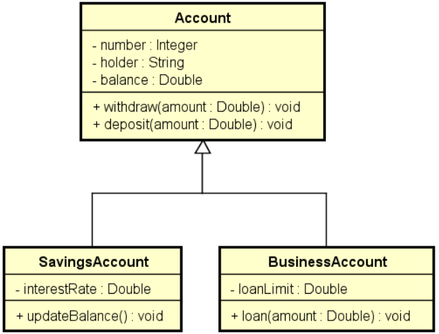

# Exemplo Heranca II

Exemplo didático para explicação de Herança, Upcasting, Downcasting e Instanceof.

Desenvolva o projeto com base no diagrama de classe exibido na imagem acima.  
Faça pelo menos uma operação de Upcasting e Downcasting. 
Faço o uso do instanceof.
